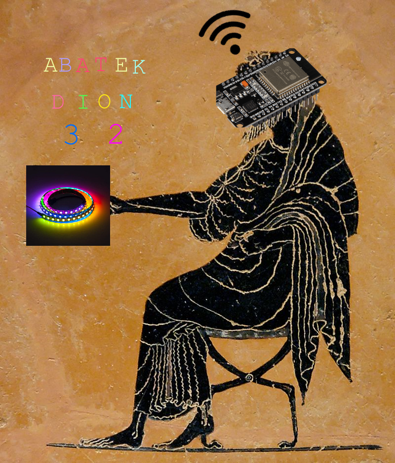

# Dion32

Named after [Dionysus](https://en.wikipedia.org/wiki/Dionysos), the greek god of theatre (and various other things).

## Setup

Remember to copy the `.vscode/c_cpp_properties.json-example` to `.vscode/c_cpp_properties.json` and edit the paths inside.

Also remember to copy the `wifi-creds.ino-example` to `wifi-creds.ino` and edit the wifi credentials to your local wifi.
